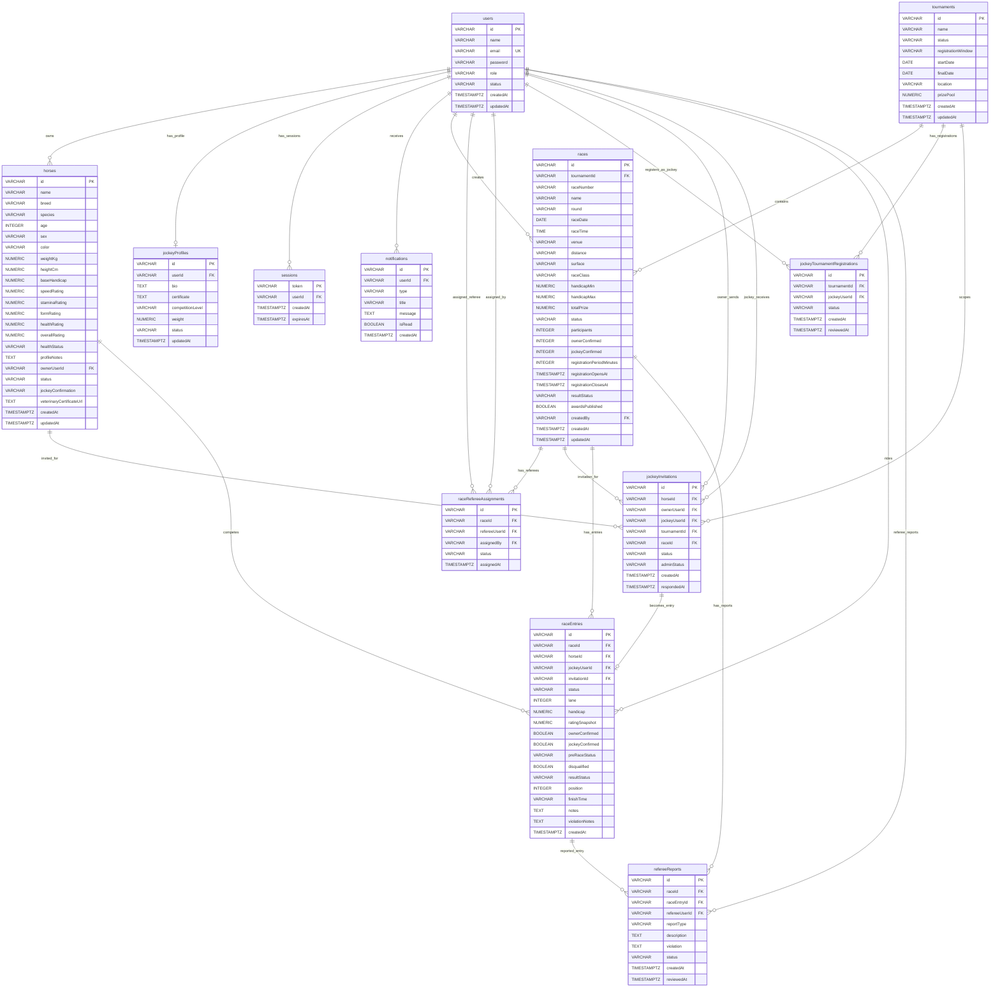

# Horse Racing Tournament ERD

## Notes

- `raceRefereeAssignments` is the real link between `races` and referee users. The old duplicated referee fields were removed from `races`.
- `raceEntries` is the main race participation table: one row links a race, horse, and jockey.
